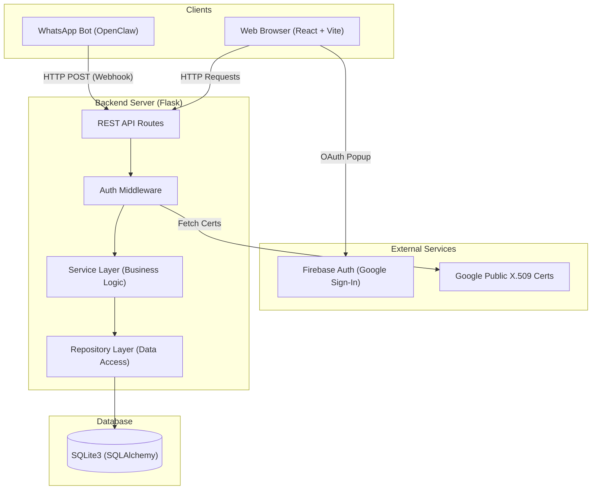
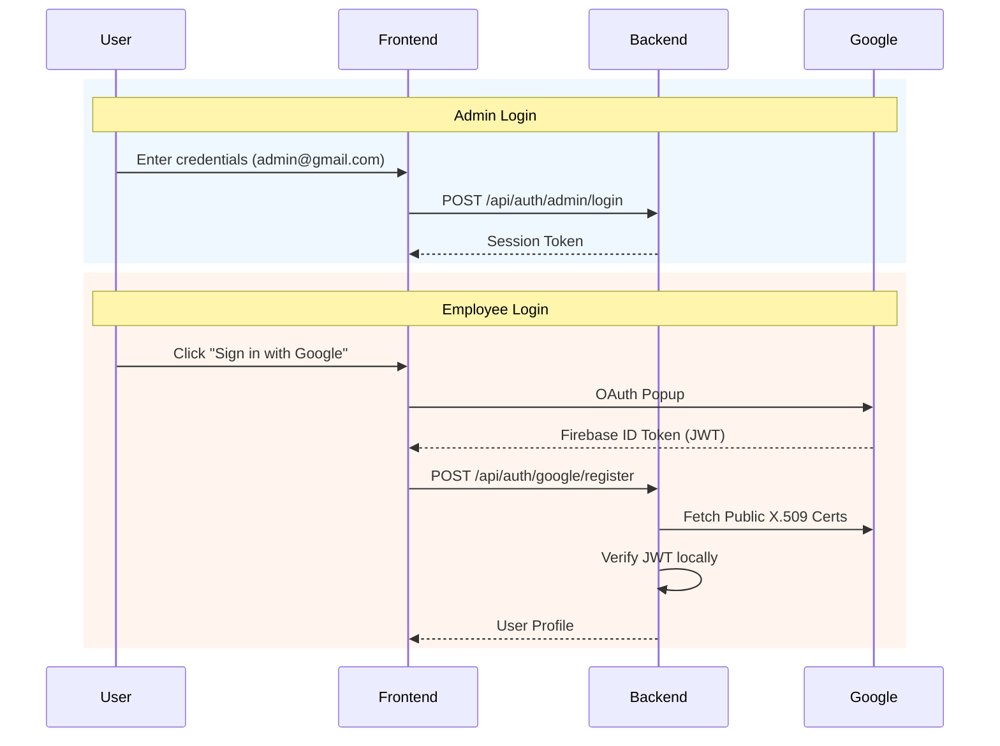
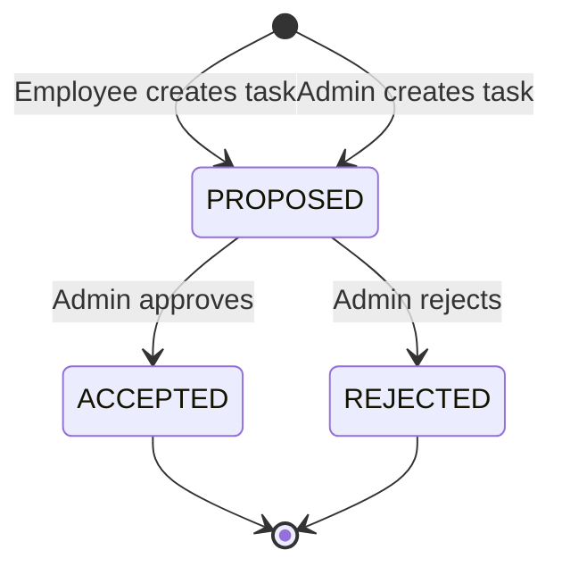
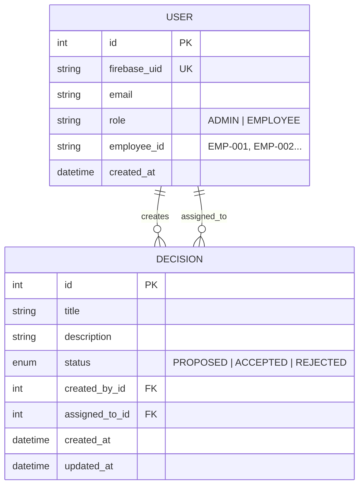

# ⚡ Task Manager — Employee Task & Decision System

A small, well-structured full-stack system for managing employee tasks — built for the **Better Software Associate Software Engineer assessment**.

- **Backend:** Python + Flask (REST API)
- **Frontend:** React (Vite)
- **Database:** SQLite (Relational, via SQLAlchemy ORM)
- **Auth:** Firebase Google Sign-In (employees) + hardcoded admin credentials
- **WhatsApp Integration:** OpenClaw AI agent queries tasks via public API

---

## 📂 Project Structure

```
├── backend/
│   ├── ai_guidance/         # AI constraint files (agents.md)
│   ├── models/              # SQLAlchemy models (User, Decision)
│   ├── schemas/             # Marshmallow input validation
│   ├── services/            # Business logic + state machine
│   ├── repositories/        # Database access layer
│   ├── routes/              # HTTP endpoints only
│   ├── middleware/           # Auth decorators (@require_auth, @require_admin)
│   ├── tests/               # Pytest suite (18/18 passing)
│   ├── firebase_config.py   # JWT verification via Google public certs
│   ├── exceptions.py        # Domain-specific error classes
│   └── app.py               # Flask factory + error handlers
├── frontend/
│   ├── src/
│   │   ├── contexts/        # AuthContext (Google + Admin token)
│   │   ├── pages/           # LoginPage, AdminDashboard, EmployeeDashboard
│   │   ├── components/      # DecisionForm, DecisionCard
│   │   └── services/        # API client (api.js)
│   └── ...
├── AI_USAGE.md              # How AI tools were used and reviewed
└── README.md                # This file
```

---

## 🏗 Architecture Diagrams

### High-Level System Architecture



### Authentication Flow



### Task State Machine



### Entity Relationship Model



---

## 🔑 Key Technical Decisions

### 1. Strict Layered Architecture
The backend enforces hard boundaries between layers. Business logic lives **only** in `services/`, database access **only** in `repositories/`, and HTTP handling **only** in `routes/`. This means adding a new feature (e.g., a new task status) requires changes in predictable places without cascading side effects.

### 2. Centralized State Machine
Task status transitions (PROPOSED → ACCEPTED/REJECTED) are enforced in a **single function** inside `decision_service.py`. Routes cannot bypass this. Repositories cannot mutate status directly. This is the most critical invariant in the system.

### 3. PyJWT Instead of Firebase Admin SDK
The original design used `firebase-admin`, which requires a service account JSON file — a deployment pain. Switching to `PyJWT` + Google's public X.509 certificates achieves the same token verification with zero secrets management. Tradeoff: we manually handle certificate caching and rotation.

### 4. Hardcoded Admin Login
Rather than managing admin accounts through Firebase, the admin uses simple credentials (`admin@gmail.com` / `admin@1234`, overridable via env vars). The session token is stored in-memory. This is intentionally simple — the assessment values simplicity over production-grade auth.

### 5. Public WhatsApp API Endpoint
The `/api/whatsapp/tasks` endpoint has **no authentication** by design. It's meant for local network use with an OpenClaw AI agent. Tradeoff: anyone on the network can query tasks by employee ID. In production, this would need API key auth or IP whitelisting.

### 6. SQLite as Database
Chosen for zero-setup deployment. SQLite handles the assessment's scale perfectly. Tradeoff: single-writer concurrency, no network access from multiple servers.

### 7. Marshmallow for Input Validation
All API input passes through Marshmallow schemas before reaching business logic. This prevents invalid data from ever touching the service layer — a key defense against misuse.

---

## ⚠️ Tradeoffs & Known Weaknesses

| Decision | Tradeoff |
|---|---|
| In-memory admin tokens | Tokens reset on server restart — acceptable for assessment scope |
| No HTTPS | Running locally; production would require TLS termination |
| No rate limiting on WhatsApp endpoint | Acceptable for local network; production needs throttling |
| SQLite single-writer | Fine for assessment; PostgreSQL for production |
| Firebase config in source | No secrets in repo (uses public project ID only), but Firebase API key is committed in frontend config — this is [safe by design](https://firebase.google.com/docs/projects/api-keys) |
| Employee IDs are sequential | Predictable (EMP-001, EMP-002); production would use UUIDs |

---

## 🧪 Testing

18 automated tests covering business logic, state transitions, assignment scoping, and error handling:

```bash
cd backend && source venv/bin/activate && python -m pytest tests/ -v
```

```
TestCreateDecision (3 tests)              ✅
TestValidTransitions (2 tests)            ✅
TestInvalidTransitions (6 tests)          ✅  ← negative cases
TestNotFound (2 tests)                    ✅
TestEmployeeScoping (1 test)              ✅
TestDecisionAssignment (4 tests)          ✅
```

Tests use an in-memory SQLite database (`TestConfig`) and are fully isolated.

---

## 🤖 AI Usage

AI coding tools were used throughout development, constrained by **`backend/ai_guidance/agents.md`** — a rules file that prevents:
- Business logic in routes
- Skipping tests
- Over-engineering
- Bypassing the state machine

Full details in **[AI_USAGE.md](AI_USAGE.md)**.

---

## 🔭 Observability

- **Domain exceptions** (`ValidationError`, `InvalidStateTransitionError`, `NotFoundError`, `UnauthorizedError`, `ForbiddenError`) are mapped to specific HTTP status codes with structured JSON error responses.
- **Python `logging`** is used throughout the service layer, middleware, and routes.
- **Global error handlers** in `app.py` catch all unhandled exceptions and return a 500 JSON response with server-side logging — no stack traces leak to clients.

---

## 🚀 Setup & Running

### Backend
```bash
cd backend
python3 -m venv venv
source venv/bin/activate
pip install -r requirements.txt
python app.py                    # Runs on http://localhost:5000
```

### Frontend
```bash
cd frontend
npm install
npm run dev                      # Runs on http://localhost:5173
```

### Firebase Setup (for Google Sign-In)
1. [Firebase Console](https://console.firebase.google.com/) → Enable **Google** sign-in provider
2. Copy web config into `frontend/src/firebase.js`
3. Set `FIREBASE_PROJECT_ID` in `backend/firebase_config.py`

### Default Credentials
- **Admin:** `admin@gmail.com` / `admin@1234`
- **Employees:** Google Sign-In

---

## 📱 WhatsApp Integration (OpenClaw)

Employees can query their tasks via WhatsApp using the public API:

```bash
curl -X POST http://localhost:5000/api/whatsapp/tasks \
     -H "Content-Type: application/json" \
     -d '{"message": "EMP-001"}'
```

Response includes a pre-formatted WhatsApp-ready `reply` field with emojis and task status indicators.

Setup: Add the API instructions to OpenClaw's `~/.openclaw/workspace/TOOLS.md` — see **[AI_USAGE.md](AI_USAGE.md)** for details.

---

## 🔄 Extension Approach

To add new features safely:

1. **New task status** (e.g., `IN_PROGRESS`) → Add to model enum, update transition rules in `decision_service.py`, add negative tests. No route changes needed.
2. **New entity** (e.g., Comments) → New model, repository, service, route files. Existing files untouched.
3. **New auth provider** (e.g., GitHub OAuth) → Add verification function in `firebase_config.py`, update middleware. Service layer unchanged.
4. **Production deployment** → Swap SQLite for PostgreSQL (change `DATABASE_URL` env var). No code changes.

The layered architecture ensures each change touches **only the relevant layer**.
