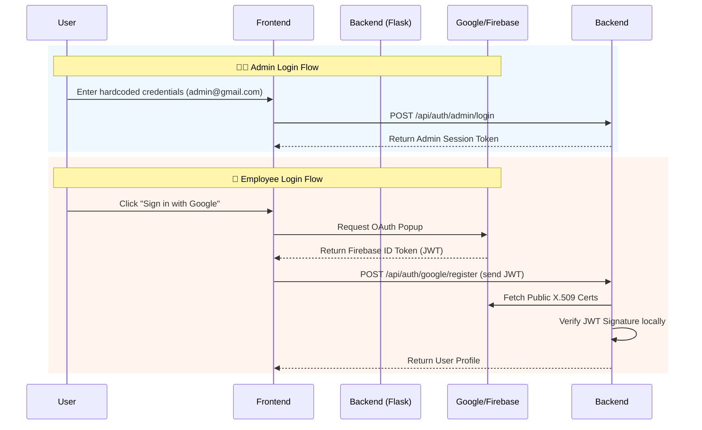
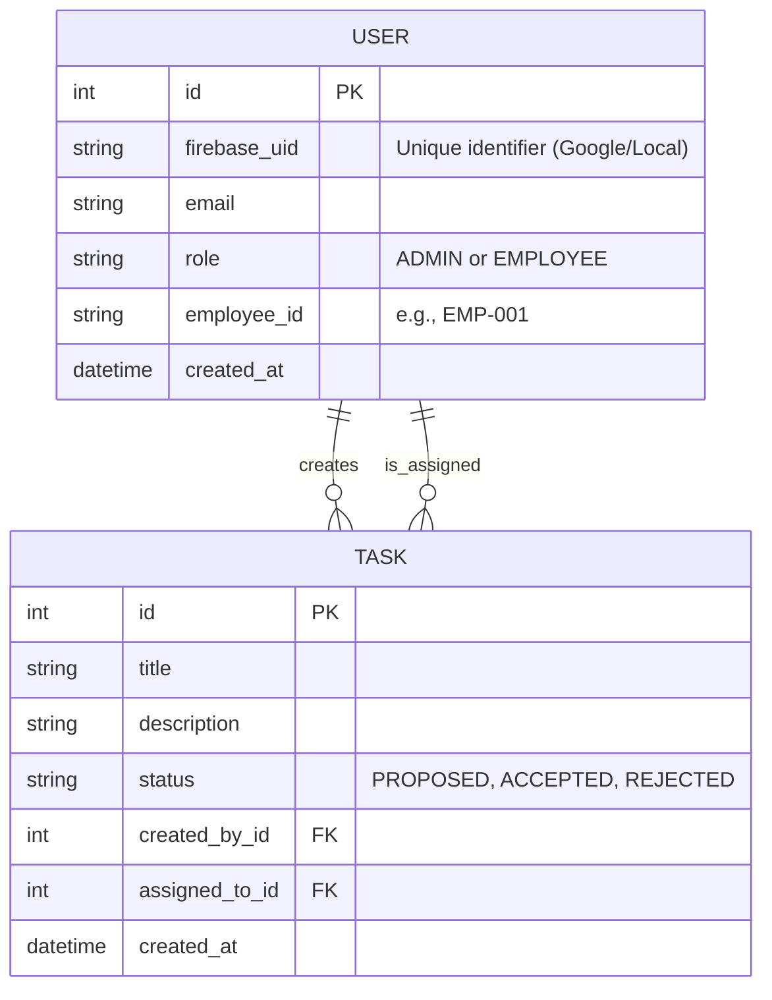

# ⚡ Task Manager (Employee Task & Decision System)

A robust, role-based full-stack application designed to manage employee tasks and decisions. This system allows employees to propose tasks and track their assignments, while administrators can review proposals, create new tasks, and assign them individually or to the entire team.

---

## ✨ Key Features

- **Role-Based Authentication:**
  - **Admin:** Fast, hardcoded login (no external dependencies).
  - **Employee:** Secure Google Sign-In via Firebase Authentication.
- **Task Management:**
  - Employees can propose tasks.
  - Admins can Accept or Reject proposed tasks.
  - Admins can create tasks and instantly assign them.
- **Advanced Assignment:**
  - Assign a task to a specific employee (e.g., `EMP-001`).
  - Assign a task to all employees at once (`all`).
- **📱 WhatsApp Chatbot Integration (OpenClaw):**
  - Employees can query their tasks directly via WhatsApp using their Employee ID.
  - Built-in public API endpoint ready for webhook consumption by AI agents like OpenClaw.

---

## 🛠 Tech Stack

**Frontend (`frontend/`):**
- React 18
- Vite
- Firebase (Only for Google Login SDK)
- Vanilla CSS (Custom Design System)

**Backend (`backend/`):**
- Python 3.13 / Flask (REST API)
- SQLite3 (Relational Database)
- SQLAlchemy (ORM)
- PyJWT & Cryptography (Google X.509 Certificate Verification)
- Pytest (Unit Testing)

---

## 🏗 System Architecture

### Authentication Flow
The system uses a hybrid authentication model. Administrative access uses secure, memory-backed session tokens, while employee access relies on stateless JWT verification using Google's public certificates.



### Entity Relationship Model



---

## 🚀 Setup & Installation

### 1. Backend Setup

```bash
# Navigate to backend directory
cd backend

# Create and activate virtual environment
python3 -m venv venv
source venv/bin/activate

# Install dependencies
pip install -r requirements.txt

# Run the server (runs on port 5000)
python app.py
```

### 2. Frontend Setup

```bash
# Navigate to frontend directory
cd frontend

# Install dependencies
npm install

# Start the Vite development server (runs on port 5173)
npm run dev
```

### 3. Firebase Configuration (For Employee Google Login)
1. Go to the [Firebase Console](https://console.firebase.google.com/).
2. Create or select a project (e.g., `fsassignintern`).
3. Navigate to **Authentication** > **Sign-in method** and enable **Google**.
4. In Project Settings, add a Web App and copy the `firebaseConfig`.
5. Paste those credentials into `frontend/src/firebase.js`.
6. Ensure your backend `firebase_config.py` has the correct `FIREBASE_PROJECT_ID`.

---

## 🧪 Testing

The backend includes a comprehensive test suite (18/18 passing) testing business logic, assignment isolation, and strict state transitions.

```bash
cd backend
source venv/bin/activate
python -m pytest tests/ -v
```

---

## 🤖 WhatsApp Bot Integration (OpenClaw)

This system includes a dedicated hook for AI agents operating on WhatsApp. 
When an employee texts their ID (e.g., `EMP-001`), the bot can instantly return their tasks.

### API Endpoint Usage

**Endpoint:** `POST /api/whatsapp/tasks`  *(No authentication required)*

You can query it via a JSON payload. The API looks for the ID in `message`, `employee_id`, `text`, or `body` properties to support various webhook formats natively.

```bash
curl -X POST "http://localhost:5000/api/whatsapp/tasks" \
     -H "Content-Type: application/json" \
     -d '{"message": "Hey, what are my tasks? I am EMP-001"}'
```

### Response Example

The response contains a pre-formatted, emoji-rich `reply` string that the bot can forward directly to the WhatsApp user.

```json
{
  "reply": "👤 *bob@company.com* (EMP-001)\n\n📋 *Assigned Tasks (1):*\n  1. 🟡 Review Q3 Budget [PROPOSED]\n\n✍️ You haven't created any tasks yet.",
  "employee": { ... },
  "assigned_tasks": [ ... ],
  "created_tasks": [ ... ]
}
```

### OpenClaw Setup Guide

If you are using [OpenClaw](https://openclaw.ai) running locally:

1. Locate your OpenClaw workspace directory (e.g., `~/.openclaw/workspace/`).
2. Open `TOOLS.md`.
3. Give the OpenClaw agent the following custom instruction:

```markdown
## Company Task Manager Integration
When an employee asks you about their tasks or provides their Employee ID (e.g., `EMP-001`) on WhatsApp:

1. You MUST use the bash or shell tool to run the following curl command:
   curl -s -X POST http://localhost:5000/api/whatsapp/tasks -H 'Content-Type: application/json' -d '{"message": "ID_HERE"}'
   (Replace ID_HERE with their actual message or Employee ID)
2. The API will respond with a JSON object. Extract the "reply" field.
3. Return the EXACT textual content of the "reply" field back to the user on WhatsApp.
```

With this instruction, any WhatsApp user messaging the OpenClaw bot will automatically receive their assigned and created tasks formatted perfectly for mobile reading.
